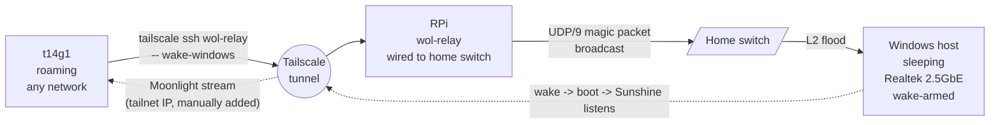

# Wake-on-LAN Relay Aspect

A NixOS Aspect that turns a host into a tailnet-triggerable
Wake-on-LAN relay for a sleeping LAN peer (typically a Windows
gaming desktop running Sunshine). A remote tailnet member triggers
the relay over SSH; the relay emits the magic packet on its local
LAN segment.

**Status: deferred.** The intended target host is an always-on
Raspberry Pi wired to the home switch. This document captures the
design so the implementation is a 30-minute task once the Pi
arrives.

## Why a relay at all

Tailscale operates at Layer 3. A WoL magic packet sent through the
tailnet reaches the target's Tailscale daemon, which is asleep when
the box is suspended, so the packet is dropped. The wake-side path
needs a Layer-2 actor on the same broadcast domain as the target
NIC. That actor receives a Layer-3 trigger over the tailnet and
emits the magic packet on its local LAN.

## Topology



The dotted lines are post-wake: once Windows is up, Moonlight on
t14g1 connects to Sunshine's tailnet IP and streams. The relay's
job is finished after the magic packet leaves the wire.

## Proposed module shape

A new feature module at `modules/services/wol-relay/default.nix`:

```nix
flake.modules.nixos.wol-relay = {
  config,
  lib,
  pkgs,
  ...
}: let
  cfg = config.myNixosModules.wolRelay;
in {
  options.myNixosModules.wolRelay = {
    enable = lib.mkEnableOption "WoL relay (wakeonlan + per-target wrappers)";

    broadcast = lib.mkOption {
      type = lib.types.nullOr lib.types.str;
      default = null;
      description = ''
        Directed broadcast address of the LAN segment (e.g.
        "192.168.1.255"). Omit for the limited broadcast
        255.255.255.255 over whichever interface the kernel
        picks; set explicitly when the relay has multiple
        interfaces or when the AP fights limited broadcast.
      '';
    };

    targets = lib.mkOption {
      default = [];
      description = ''
        Hosts to expose as `wake-<name>` wrapper binaries.
      '';
      type = lib.types.listOf (lib.types.submodule {
        options = {
          name = lib.mkOption {
            type = lib.types.str;
            description = ''
              Wrapper name; the binary lands as `wake-<name>`.
            '';
          };
          mac = lib.mkOption {
            type = lib.types.str;
            description = "Target NIC MAC (colon-separated).";
          };
        };
      });
    };
  };

  config = lib.mkIf cfg.enable {
    environment.systemPackages =
      [pkgs.wakeonlan]
      ++ map (t:
        pkgs.writeShellApplication {
          name = "wake-${t.name}";
          runtimeInputs = [pkgs.wakeonlan];
          text =
            if cfg.broadcast == null
            then "wakeonlan ${t.mac}"
            else "wakeonlan -i ${cfg.broadcast} ${t.mac}";
        })
      cfg.targets;
  };
};
```

A separate concern, already in the tree as commit `15d66fa`:
`myNixosModules.tailscale.enableSSH = true` appends `--ssh` to
`tailscale up`. The relay host opts into both:

```nix
myNixosModules = {
  tailscale = {
    enable = true;
    enableSSH = true;
  };
  wolRelay = {
    enable = true;
    broadcast = "192.168.1.255";
    targets = [
      { name = "windows"; mac = "30:56:0F:72:CC:EC"; }
    ];
  };
};
```

`enableSSH` and `wolRelay` are deliberately orthogonal: a host can
be a WoL relay reachable by other means (HTTP, a systemd socket, a
local service), and a host can want tailnet SSH for reasons other
than wake. Coupling them would force `wakeonlan` into every
SSH-enabled host's closure.

## RPi as the relay

Cheapest reliable shape: a Pi 4 / Pi 3B+ / Pi Zero 2 W + USB-Ethernet
(the W's onboard Wi-Fi defeats the purpose, but the USB port gives
wired). Wired into the home switch with a DHCP lease, running NixOS
on aarch64. Add to the fleet:

1. `modules/hosts/wol-relay/default.nix`: minimal `system-cli` host,
   no display, no `system-desktop`. Opts into `myNixosModules.tailscale`
   (`enable + enableSSH`) and `myNixosModules.wolRelay`.
2. Hardware bootstrap: aarch64 NixOS SD-card image
   (`nixos-image-sd-aarch64`), first boot on the LAN with SSH on,
   then `nixos-rebuild switch --target-host root@<pi-ip>` from
   cimmerian or t14g1. Once stable, follow the `nixos-anywhere`
   recipe from B.2 backlog for reproducible reflashes.
3. Tailscale first auth: `sudo tailscale up --ssh` on the Pi, sign
   in via the displayed URL once. Then tag the device in the admin
   console as `tag:wol-relay` and set `tag:wol-relay` to `tagOwners`
   so the next re-auth doesn't need browser interaction.

## Tailnet ACL

The ACL is the JSON document at `https://login.tailscale.com/admin/acls`.
Two blocks govern this setup, the `tagOwners` section that says
who can apply the wol-relay tag, and the `ssh` block that lets your
laptop SSH the relay:

```jsonc
{
  "tagOwners": {
    "tag:laptop": ["autogroup:admin"],
    "tag:wol-relay": ["autogroup:admin"],
  },
  "ssh": [
    {
      "action": "accept",
      "src": ["tag:laptop"],
      "dst": ["tag:wol-relay"],
      "users": ["jmfv"],
    },
  ],
}
```

Default-deny semantics: any tailnet member not matched by an
`ssh.accept` rule is rejected when they try `tailscale ssh wol-relay`.
Scope `src` tightly to your own tagged devices, not `autogroup:members`.

Tailscale SSH has no built-in per-command restriction. If you want
to neuter shell access to just the wake wrapper, set in the relay's
`services.openssh.extraConfig`:

```
Match User jmfv
  ForceCommand /run/current-system/sw/bin/wake-windows
  PermitTTY no
```

This fights the spirit of Tailscale SSH and breaks recovery, so
only consider it after the relay is otherwise stable.

## MAC handling

The target's MAC isn't a secret. Every Ethernet frame the NIC sends
on the LAN broadcasts it. Hardcoding it in nix is fine:

```nix
myNixosModules.wolRelay.targets = [
  { name = "windows"; mac = "30:56:0F:72:CC:EC"; }
];
```

If multiple consumers ever need the MAC (a t14g1 wrapper, multiple
relays, a Moonlight config), promote it to a `systemConstants.windowsMac`
attribute under `modules/system/constants/default.nix`. Not worth doing
for a single relay + a single trigger source.

For Windows hosts the MAC is reachable two ways: `ipconfig /all`
mislabels adapters often (Wi-Fi can show as "Ethernet adapter
Ethernet N"); cross-check with the OUI vendor and use the explicit
adapter name with PowerShell:

```
Get-NetAdapter -InterfaceDescription "Realtek PCIe 2.5GbE Family Controller" `
  | Format-List Name, MacAddress, Status, LinkSpeed
```

## End-to-end recipe (when the Pi arrives)

1. Boot the Pi on the LAN, complete `tailscale up --ssh`, tag as
   `tag:wol-relay` in the admin console.
2. Add `modules/hosts/wol-relay/default.nix` + `modules/services/wol-relay/default.nix`
   in this repo. Opt into both feature modules from the host.
3. Push the ACL JSON above.
4. From t14g1 anywhere on the internet:

   ```
   tailscale ssh wol-relay -- wake-windows
   ```

   You can wrap that in a `wake-windows` `pkgs.writeShellApplication`
   on t14g1 so the laptop side mirrors the relay's wrapper name; the
   alternative is to type the SSH command directly.

5. Sleep / shut down the Windows host. Fire the wrapper. Verify wake
   within ~3s. tcpdump-on-relay sanity check is documented in the
   companion Windows-prep notes.

## What's NOT in this design

- **No `tailscale-wakeonlan` web UI.** Extra service, extra port,
  extra auth surface; for a single-user setup the SSH-relay
  one-liner is enough.
- **No Moonlight-driven WoL over tailnet.** Moonlight's built-in
  WoL broadcasts `255.255.255.255` and unicasts to known IPs; the
  broadcast doesn't traverse tailnet and the unicast hits a
  sleeping Tailscale daemon. Subnet routing the LAN through the
  relay could enable this, but trades surface (whole LAN reachable
  from tailnet) for ergonomics. Deferred.
- **No `Match User ForceCommand` lockdown.** Adds friction and
  fights Tailscale SSH; only revisit if the relay grows surface.

## Windows-side prep

The target machine needs BIOS WoL, NIC driver power management,
Fast Startup disabled, and verified `S3 (Sleep)` availability via
`powercfg /a`. Out of scope for this repo (Windows isn't a fleet
member); local working notes live at `docs/wake-on-lan-windows.md`
(uncommitted, personal cheat-sheet).
